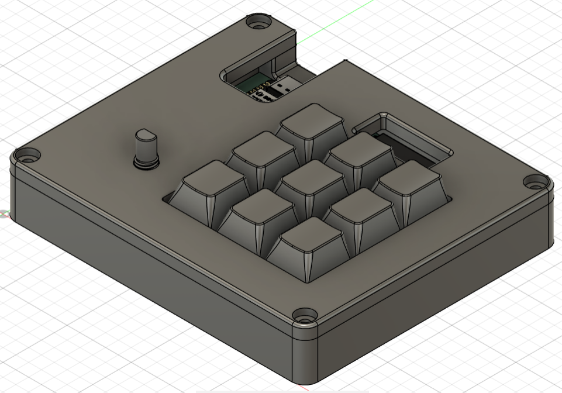
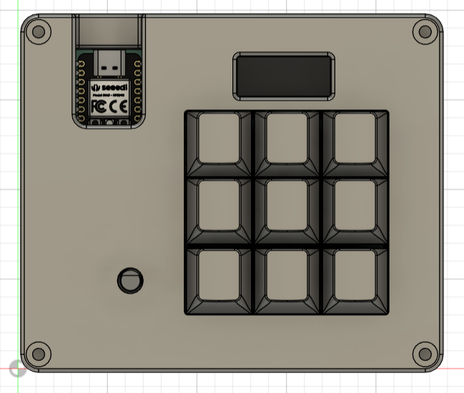
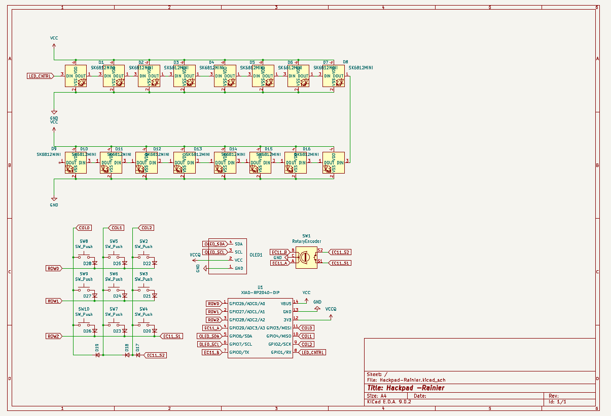
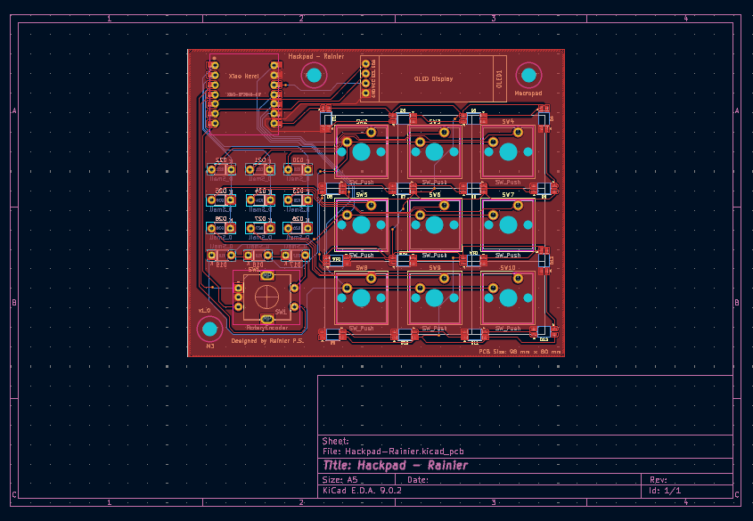

# Hackpad-Rainier

A compact 3x3 macropad with an encoder, OLED screen, LED backlight, and multiple keymap layers. Built using KMK firmware and Seeed XIAO RP2040. Designed for shortcuts, media control, number input, and visual layer feedback.

## Features

- 3×3 key matrix (9 physical keys)
- EC11 rotary encoder with push switch
- Layer switching via encoder press or key combo
- OLED screen for layer/mode display
- WS2812B LED backlight with multiple brightness modes
- KMK firmware (Python-based, flexible and beginner-friendly)
- Custom PCB (2-layer) and 3D-printed case

## Visual Overview

### Assembled Hackpad

>In accordance with the submission requirements, the interior of both the top and bottom parts of the case are branded with my name.

### Schematic

### PCB Layout

## Layer Configuration

### Layer 0 – Shortcuts and Media
| Top Row       | Middle Row     | Bottom Row    |
|---------------|----------------|----------------|
| Media Prev    | Play/Pause     | Media Next     |
| Undo          | Redo           | Save           |
| Copy          | Paste          | Cut            |

Encoder: Volume control (default)  
Encoder button: Toggle between volume, zoom, brightness, and timeline scrubbing

### Layer 1 – Numpad
| Top Row       | Middle Row     | Bottom Row    |
|---------------|----------------|----------------|
| 7             | 8              | 9              |
| 4             | 5              | 6              |
| 1             | 2              | 3              |

Encoder and screen modes remain active.

## Firmware

- Written in Python using KMK firmware
- Supports multiple layers and encoder modes
- Keymap stored in `keymap.py`
- OLED uses SSD1306 I²C (SDA = GP6, SCL = GP7)
- LEDs controlled on GP1
- Fully customizable layout

## BOM: Bill of Materials

| Component                   | Quantity | Notes                                                                 |
|-----------------------------|----------|-----------------------------------------------------------------------|
| MX-Style switches           | 9        | Any MX-style switch (linear/tactile/clicky)                          |
| Blank DSA keycaps (White)   | 9        | Or any compatible keycaps                                            |
| Through-hole 1N4148 Diodes  | 12       | For switch matrix and rotary encoder                                 |
| EC11 rotary encoder         | 1        | With built-in push button                                            |
| 0.91" 128x32 OLED (I²C)     | 1        | SSD1306-compatible (GND/VCC/SCL/SDA)                                 |
| SK6812 MINI-E LEDs          | 16       | For underglow or key backlighting                                    |
| Seeed XIAO RP2040           | 1        | Through-hole version (required for compatibility)                    |
| Custom PCB                  | 1        | 2-layer, ≤100×100mm                                                  |
| 3D Printed Case             | 1        | Two parts: top and bottom                                            |
| M3×5m×4mm heat-set inserts  | 7        | Used for assembly                                                    |
| M3x16mm screws              | 7        | For screwing into inserts                                            |
